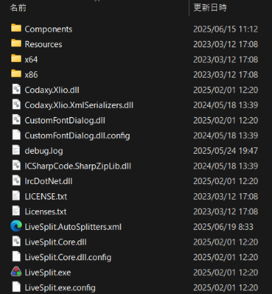
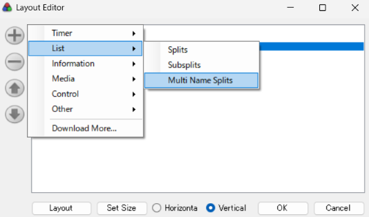
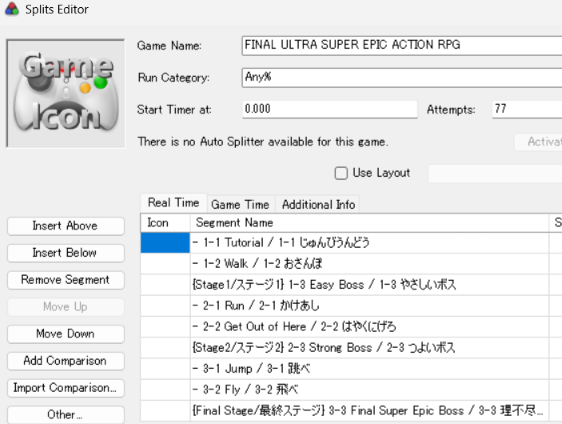
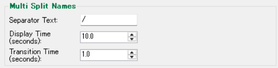

# LiveSplit MultiNameSplits Component


[**Read in English/英語のREADMEはこちら**](README.md)

LiveSplitのスプリット名を一定時間ごとに自動で切り替えて表示するコンポーネントです。

## 概要

このコンポーネントは、Subsplitsコンポーネントをベースに、新しい機能を追加して開発されたものです。以下の機能を提供します：

- **Multi Name Splits機能**: 【メイン機能】スプリット名を一定時間ごとに自動切り替え
- **初期設定の自動インポート**: 既存コンポーネントの設定を自動で引き継ぎ
- **Subsplits ON/OFF機能**: Subsplits機能の有効/無効を切り替え可能（無効にすることでSplitsと同じように使える）

### 使用例
- スプリット名を母国語と外国語で交互に表示
- スプリット名と区間の短い説明文を交互に表示
- 複数の情報を1つのスプリット名欄で管理


[参考動画 (YouTube)](https://youtu.be/SaANew-s__4)

## 対応バージョン
- LiveSplit 1.8.30 ~ 1.8.35（最新版）

## つかいかた

### 1. ダウンロード

`MultiNameSplits.dll` ファイルをダウンロードしてください：
- **最新版はこちら→** [**MultiNameSplits.dll**](https://github.com/a-ki-yoshi/LiveSplit.MultiNameSplits/releases/download/1.1.1/MultiNameSplits.dll)
- その他のバージョンは[GitHub Releases](https://github.com/a-ki-yoshi/LiveSplit.MultiNameSplits/releases) をご覧ください
- dllとか聞きなれてなくて怖いかもしれませんが、襲ってこないので大丈夫です

### 2. インストール

1. LiveSplitのアプリが入っているフォルダーを探します
- ダウンロード時からフォルダー名を変更していない場合は、「LiveSplit_x.x.xx」のような名前になっているはずです
- 場所がわからなかったら、Windows Explorerの右上に「LiveSplit.exe」など入力したりして検索してください
- もしもLiveSplitアプリを複数所持している場合は、注意して正しいものを選んでください
- "Components" フォルダーや "LiveSplit.exe" ファイルなどが置いてあれば正解です
   


2. `Components` フォルダーをクリックして移動します
3. ダウンロードした `MultiNameSplits.dll` を、そこに置きます
- dllファイルがいっぱいあって怖いかもしれませんが、襲ってこないので大丈夫です


### 3. コンポーネントの追加

1. LiveSplitを開く（すでに開いていた場合は、再起動してください）
2. レイアウトエディターを開く（LiveSplitのタイマー画面を右クリック → Edit Layout）


3. 左上側の「+」ボタンをクリック
4. 「List」→「Multi Split Names」を選択して追加
- 「Splits」や「Subsplits」コンポーネントが既に存在する場合、コンポーネント追加時に、その設定が初期設定として反映されます



5. 一覧に表示されました。「Multi Split Names」をドラッグすることで表示位置を調整できます
- もともと「Splits」や「Subsplits」を使用していた場合は、左側の「-」ボタンで削除しても構いません


## 基本的な使い方

### スプリット名の設定

スプリット名に区切り文字を含めることで、複数の名前を設定できます：

```
例: "Boss1/ボス1" → "Boss1" と "ボス1" を交互に表示
例: "Checkpoint A/チェックポイントA/CP-A" → 3つの名前を順番に表示
```
【Subsplits機能を使う場合】
```
例: "- Boss1/ボス1" → "Boss1" と "ボス1" を交互に表示
例: "{Area1/エリア1} Boss1/ボス1" → 
      セクション名は"Area1" と "エリア1" を交互に表示
      個別のスプリット名は"Boss1" と "ボス1" を交互に表示
```
【ちなみに】
```
区切り文字の前後にスペースがあっても、無視されるので問題ありません。
↓画像のように、区切り文字の前後にスペースがあっても同じ結果になります
例: "Boss1 / ボス1" → "Boss1" と "ボス1" を交互に表示
```




### 区切り文字の設定

デフォルトでは `/` が区切り文字として使用されます。他の文字に変更することも可能です：

```
例: "Boss1|ボス1" （区切り文字を | に設定した場合）
例: "Boss1-ボス1" （区切り文字を - に設定した場合）
```

## レイアウトエディターの設定

### Multi Split Names

"Multi Name Splits" タブ内の真ん中あたり、"Split Names" と "Icons" の間にあります




#### Separator Text（区切り文字）
- **説明**: スプリット名を分割するための文字
- **デフォルト値**: `/`
- **設定可能文字**: 任意の文字（複数文字や記号以外もOK）
- **制限**: `-` `{` `}` は使用不可（Subsplits機能で使用される記号のため）

#### Display Time（表示時間）
- **説明**: 各名前を表示する時間
- **デフォルト値**: 2秒
- **範囲**: 1～999999秒

#### Transition Time（トランジション時間）
- **説明**: 名前切り替え時のフェードイン・フェードアウト時間
- **デフォルト値**: 1.0秒
- **範囲**: 0.1～999.0秒
- **注意**: Display Timeの1/2以下に設定することを推奨

#### Details

- **概要**: 区切り文字で分割された各テキスト部分ごとに、表示有無・時間・色・フォントを個別設定できます。
- **表示条件**: `Separator Text` がどのスプリット名にも含まれない場合、このセクションは表示されません。

**各項目の説明**
- **Show**: 該当部分の表示/非表示を切り替えます。全てを非表示にはできません（表示中が1つのみの場合は切替不可）。
- **Display Time**: その部分を次に切り替えるまでの表示時間（秒）。デフォルトは全体の `Display Time` と同じ。個別に変更すると以後はResetボタンを押さない限り連動しません。
- **Color and Font (Color)**: その部分の文字色。設定すると他の箇所の色設定より優先されます。※スプリットごとに区切り数が異なる場合は、色がフェードなしで切り替わることがあります。
- **Color and Font (Font)**: その部分のフォント。設定すると `Layout` タブのフォント設定より優先されます。フォント名が長すぎる場合、ボタンに表示されるフォント情報が途中までしか表示されないことがあります。
- **Move (Up/Down)**: 設定項目の表示順のみ変更します（スプリット名の表示順序は変わりません）。
- **Reset**: その部分の Show/Display Time/Color/Font を初期化し、デフォルト値に戻します（リセット後は全体設定の反映が再び有効になります）。

### Subsplits

タブを開いた時にスクロールしなくて済む位置にあります。青い文字が目印

#### Enable Subsplits
- **説明**: Subsplits機能のON/OFFを切り替え
- **デフォルト値**: 
   - コンポーネント追加時にSplitsコンポーネントのみ存在していた場合はOFF
   - コンポーネント追加時に他のMulti Name Splitsコンポーネントが存在しており、しかも当機能がOFFに設定されている場合はOFF
   - それ以外はON


## よくある問題と解決方法

### 区切り文字が機能しない
**原因**: スプリット名に区切り文字が含まれていない、または禁止文字を使用している

**解決方法**: 
- スプリット名に区切り文字が含まれているか確認
- 禁止文字（`-` `{` `}`）を使用していないか確認

### 名前の切り替えが表示されない
**原因**: Transition Timeが長すぎる

**解決方法**: Transition Timeを短くする（推奨: Display Timeの1/2以下）

### フェードイン・フェードアウトの表示がおかしい
**原因**: Transition TimeがDisplay Timeの1/2より大きい

**解決方法**: Transition TimeをDisplay Timeの1/2以下に設定

### 初期設定がインポートされない
**原因**: 対象コンポーネントが存在しない、またはコンポーネント追加前に削除してしまった

**解決方法**:
   - 既存の "Multi Name Splits" "Subsplits" "Splits" コンポーネントが存在するか確認
   - コンポーネント追加前に削除してしまった場合は、レイアウトファイル保存前であれば、アプリ再起動などで状態を元に戻せば間に合います

## 詳細仕様

より詳細な仕様については、[technical-specification.ja.md](docs/technical-specification.ja.md) をご参照ください。

## 開発情報

- **開発要件**: .NET Framework 4.8.1
- **フォーク元**: [LiveSplit.Subsplits](https://github.com/LiveSplit/LiveSplit.Subsplits)
- **ライセンス**: [MIT License](LICENCE.md)

## バグ報告、機能要望、お問い合わせ

**🌟✨🎉🎊🚀🥳🕺💃🪩 大 歓 迎 🪩💃🕺🥳🚀🎊🎉✨🌟**

問題や質問、なんか言いたいことがある場合は、以下の方法でお問い合わせください：

- GitHubいけるぜ！って方は [GitHub Issues](https://github.com/a-ki-yoshi/LiveSplit.MultiNameSplits/issues)
- GitHubとかよくわからんなーって方は [TwitterのDMやメンション](https://x.com/OribeAkiyoshi)※不具合が多いサービスなので気づけない恐れが0ではない
- なんでもいいから気づいてくださいって方は [Twitchのウィスパーとか](https://www.twitch.tv/a_ki_yoshi)
- 匿名がいいですって方は [マシュマロ](https://marshmallow-qa.com/oribeakiyoshi)
- あとDiscordのRTAイベントとかのサーバーにいるID: `a_ki_yoshi`（名: Akiyoshi）ってアカウントを見つけてDM送るとか

※バグ報告の際は、再現手順や環境情報（アプリのバージョンとか）も含めての情報提供にご協力お願いします！

## このプロジェクトへの貢献

**🍵🌱🧸🐾😸 たすけて 😸🐾🏡🌷☕️**

気軽に手伝ってくれると嬉しいです：
- このリポジトリをフォーク
- 機能ブランチを作成 (`git checkout -b feature/amazing-feature`)
- 変更をコミット (`git commit -m 'Add some amazing feature'`)
- ブランチにプッシュ (`git push origin feature/amazing-feature`)
- プルリクエストを作成

## 更新履歴

### v1.1.2
- Display Timeのデフォルト値を10秒から2秒に変更
- Subsplits設定を使用時の不具合を修正

### v1.1.1
- Subsplitsコンポーネントの更新をマージ（列の初期名称を修正）

### v1.1.0
- Details機能を追加
- Custom Variables機能の有無にかかわらず動作するように対応

### v1.0.1
- [Issue #1](https://github.com/a-ki-yoshi/LiveSplit.MultiNameSplits/issues/1)対応

### v1.0.0
- 初回リリース
- Multi Name Splits機能
- 初期設定の自動インポート機能
- Subsplits ON/OFF機能

---

**注意**: 
このコンポーネントはLiveSplit.Subsplitsをフォークして開発されています。元のSubsplitsコンポーネントやSplitsコンポーネントとの完全な互換性は保証されません。 
でもできるだけ互換性持たせるようにしていきたいとは思っています（小声）

## License and Attribution

This project is based on [LiveSplit.Subsplits](https://github.com/LiveSplit/LiveSplit.Subsplits),  
which is part of the [LiveSplit](https://github.com/LiveSplit/LiveSplit) project.  
LiveSplit is licensed under the [MIT License](https://github.com/LiveSplit/LiveSplit/blob/master/LICENSE).

The original source is © the LiveSplit team.
Special thanks to the original developers.
