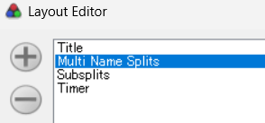

# LiveSplit MultiNameSplits Component


[**日本語のREADMEはこちら/Read in Japanese**](README.ja.md)

This is a LiveSplit component that automatically switches between multiple split names at set intervals.

## Overview

This component is based on the Subsplits component, with new features added. It provides the following:

- **Multi Name Splits**: *Main feature* — Automatically switches between multiple split names at set intervals
- **Smart Initial Settings Import**: Automatically imports settings from existing components
- **Subsplits ON/OFF**: You can enable or disable Subsplits (when disabled, it works just like the Splits component)

### Example Use Cases
- Alternate split names between your native language and a foreign language
- Alternate between a split name and a short description of the segment
- Manage multiple pieces of information in a single split name field


[Reference Video (YouTube)](https://youtu.be/SaANew-s__4)

## Supported Versions
- LiveSplit 1.8.30 ~ 1.8.35 (latest)

## How to Use

### 1. Download

Download the `MultiNameSplits.dll` file:
- **Latest version →** [**MultiNameSplits.dll**](https://github.com/a-ki-yoshi/LiveSplit.MultiNameSplits/releases/download/1.1.0/MultiNameSplits.dll)
- For other versions, see [GitHub Releases](https://github.com/a-ki-yoshi/LiveSplit.MultiNameSplits/releases)
- If you're not familiar with DLL files, don't worry—they're safe!

### 2. Installation

1. Find your LiveSplit application folder.
   - If you haven't renamed it, it should be something like `LiveSplit_x.x.xx`
   - If you don't know where it is, search for `LiveSplit.exe` in Windows Explorer
   - If you have multiple LiveSplit installations, make sure to pick the right one
   - If you see a `Components` folder and `LiveSplit.exe`, you're in the right place
   


2. Open the `Components` folder.
3. Place the `MultiNameSplits.dll` file there.
   - There may be a lot of DLL files, but don't worry—they're all friendly!


### 3. Add the Component

1. Open LiveSplit (restart if it was already running)
2. Open the Layout Editor (right-click the timer window → Edit Layout)


3. Click the "+" button at the top left
4. Select "List" → "Multi Split Names" to add it
   - If you already have "Splits" or "Subsplits" components, their settings will be imported as initial settings


5. The component will appear in the list. You can drag "Multi Split Names" to adjust its position.
   - If you were using "Splits" or "Subsplits" before, you can remove them with the "-" button on the left




## Basic Usage

### Setting Split Names

You can set multiple names for a split by including a separator character:

```
Example: "Boss 1 / The Red Tyrant" → alternates between "Boss 1" and "The Red Tyrant"
Example: "Area 3 / The Green Woods / Too Much RNG" → cycles through three names
```
**When using Subsplits:**
```
Example: "- Boss 1 / The Red Tyrant" → alternates between "Boss 1" and "The Red Tyrant"
Example: "{Stage 1 / The Beginning} Boss 1 / The Red Tyrant" → 
      Section name alternates between "Stage 1" and "The Beginning"
      Individual split name alternates between "Boss 1" and "The Red Tyrant"
```
**Note:**
```
Spaces before or after the separator are ignored, so there is no problem.
↓ As shown in the image, the same result is obtained even if there is a space before or after the separator.
Example: "Area 2 / The Green Woods" → alternates between "Area 2" and "The Green Woods"
```


### Setting the Separator

By default, `/` is used as the separator, but you can change it to any character:

```
Example: "Boss 1|The Red Tyrant" (if you set the separator to |)
Example: "Boss 1-The Red Tyrant" (if you set the separator to -)
```

## Layout Editor Settings

### Multi Split Names

You can find the "Multi Name Splits" tab in the middle, between "Split Names" and "Icons".


#### Separator Text
- **Description**: The character(s) used to split the names
- **Default**: `/`
- **Allowed**: Any character(s) (including non-symbols)
- **Not allowed**: `-`, `{`, `}` (used by Subsplits)

#### Display Time
- **Description**: How long each name is displayed
- **Default**: 10 seconds
- **Range**: 1–999999 seconds

#### Transition Time
- **Description**: Fade-in/fade-out time when switching names
- **Default**: 1.0 seconds
- **Range**: 0.1–999.0 seconds
- **Note**: It is recommended to set this to half or less of the Display Time

#### Details

- **Overview**: Configure each text segment split by the separator individually: visibility, time, color, and font.
- **Visibility condition**: If `Separator Text` is not present in any split name, this section will not appear.

**Items**
- **Show**: Toggle visibility of the segment. You cannot hide all segments (when only one is visible, it cannot be turned off).
- **Display Time**: How long this segment stays visible before switching (in seconds). Default equals the global `Display Time`. Once changed here, it will not follow the global value again unless you press Reset.
- **Color and Font (Color)**: Text color for this segment. Overrides color settings elsewhere. Note: If the number of segments differs between splits, colors may switch without a fade.
- **Color and Font (Font)**: Font for this segment. Overrides the font configured in the `Layout` tab. If the font name is too long, the button may show it only partially.
- **Move (Up/Down)**: Changes only the order of the settings entries (does not change the display order of split name segments).
- **Reset**: Restores Show/Display Time/Color/Font of this segment to defaults (after Reset, global settings will apply again).

### Subsplits

This tab is easy to find—look for the blue text.

#### Enable Subsplits
- **Description**: Toggle Subsplits ON/OFF
- **Default**: 
   - OFF if only the Splits component existed when adding
   - OFF if another Multi Name Splits component exists and has this feature OFF
   - ON otherwise


## Troubleshooting

### Separator doesn't work
**Cause**: The split name doesn't contain the separator, or a forbidden character is used

**Solution**: 
- Check that the split name contains the separator
- Make sure you are not using forbidden characters (`-`, `{`, `}`)

### Names don't switch
**Cause**: Transition Time is too long

**Solution**: Set Transition Time shorter (recommended: half or less of Display Time)

### Fade-in/fade-out looks strange
**Cause**: Transition Time is greater than half of Display Time

**Solution**: Set Transition Time to half or less of Display Time

### Initial settings are not imported
**Cause**: The target component does not exist, or was deleted before adding

**Solution**:
   - Check that "Multi Name Splits", "Subsplits", or "Splits" components exist
   - If you deleted a component before adding, you can restore the state by restarting the app before saving the layout file

## Technical Details

For more detailed specifications, see [technical-specification.md](docs/technical-specification.md).

## Development Info

- **Requirements**: .NET Framework 4.8.1
- **Based on**: [LiveSplit.Subsplits](https://github.com/LiveSplit/LiveSplit.Subsplits)
- **License**: [MIT License](LICENCE.md)

## Bug Reports, Feature Requests, Contact

**🌟✨🎉🎊🚀🥳🕺💃🪩 ALL CONTRIBUTIONS WELCOME 🪩💃🕺🥳🚀🎊🎉✨🌟**

If you have any questions, issues, or just want to say hi, feel free to contact me:

- If you're comfortable with GitHub: [GitHub Issues](https://github.com/a-ki-yoshi/LiveSplit.MultiNameSplits/issues)
- If not, you can DM or mention me on [Twitter](https://x.com/OribeAkiyoshi) (sometimes notifications are missed)
- Or send a whisper on [Twitch](https://www.twitch.tv/a_ki_yoshi)
- Or use [Marshmallow](https://marshmallow-qa.com/oribeakiyoshi) for anonymous messages
- Or DM me on Discord (ID: `a_ki_yoshi`, name: Akiyoshi) if you find me in an RTA event server

*When reporting bugs, please include steps to reproduce and your environment (app version, etc.) if possible!*

## Contributing

**🍵🌱🧸🐾😸  Help Wanted! 😸🐾🏡🌷☕️**

I'd love your help!  
- Fork this repository
- Create a feature branch (`git checkout -b feature/amazing-feature`)
- Commit your changes (`git commit -m 'Add some amazing feature'`)
- Push to your branch (`git push origin feature/amazing-feature`)
- Open a pull request

## Changelog

### v1.1.0
- Added Details functionality
- Made compatible with or without Custom Variables functionality

### v1.0.1
- Fixed [Issue #1](https://github.com/a-ki-yoshi/LiveSplit.MultiNameSplits/issues/1)

### v1.0.0
- Initial release
- Multi Name Splits feature
- Smart initial settings import
- Subsplits ON/OFF feature

---

**Note:**  
This component is developed as a fork of LiveSplit.Subsplits. Full compatibility with the original Subsplits and Splits components is not guaranteed.  
But I'll do my best to keep it as compatible as possible!

## License and Attribution

This project is based on [LiveSplit.Subsplits](https://github.com/LiveSplit/LiveSplit.Subsplits),  
which is part of the [LiveSplit](https://github.com/LiveSplit/LiveSplit) project.  
LiveSplit is licensed under the [MIT License](https://github.com/LiveSplit/LiveSplit/blob/master/LICENSE).

The original source is © the LiveSplit team.  
Special thanks to the original developers.
